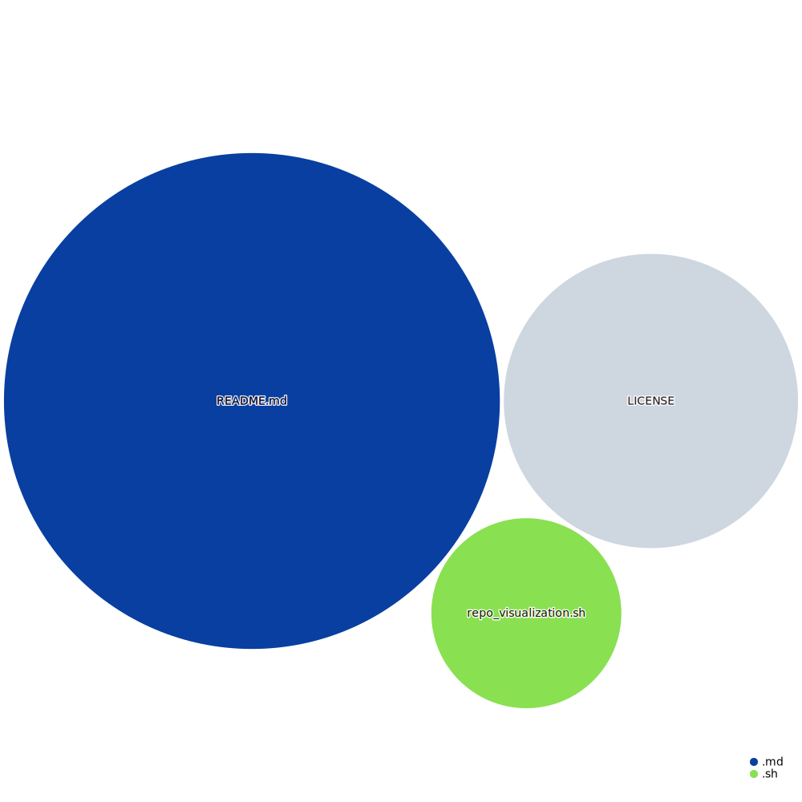

<div align="center">
  <h1>Repository Visualization Template</h1>
</div>


<Details> <Summary> <i>Tools:</i> </Summary>

##### Github Action:&nbsp;[](https://githubnext.com/projects/repo-visualization)<br>
##### Main Text-Editor:&nbsp;[](https://code.visualstudio.com/)<br>
##### Languages:&nbsp;[](https://www.markdownguide.org)[](https://yaml.org) [](https://git-scm.com)<br>
##### Web-Interface:&nbsp;[](https://create-react-app.dev)&nbsp; [](https://azure.microsoft.com)<br>
##### Version Control:&nbsp;[](https://github.com)&nbsp;[](https://git-scm.com)<br>
[](https://github.com/EstebanMqz/Git-Commands)<br>

##### License:&nbsp;[](https://creativecommons.org/licenses/by/3.0/)
</Details>

---

## **Description:**
Template to make / review repositories interactive by their content size. <br>
[`pwd`](https://en.wikipedia.org/wiki/PWD) <i>default:</i> `diagram.svg`.

<Details>
<Summary> <b>Workflow:</b> </Summary>
<br>
<i>Setup workflow manually or use the following steps:</i><br><br>

1. Use this [`template`](https://github.com/EstebanMqz/repo-visualization/generate) to create a new repository.
2. Go to `Settings` tab in <u>repository</u> -> *Code and automation* $\rightarrow$ `Actions-General` <br>
<i>Workflow permissions</i> $\rightarrow$ `Read and write permissions` in *Workflow* section (<i>optional</i> ✔️ pull requests).<br>

<i><b>Note:</b> If diagram is not showing go to `Actions` tab in repository -> select last available `workflow run` -> `Re-run all jobs`.</i>
<br><br>



Triggered by <i>workflow runs</i> action or <i>pushes/pull</i> requests to main branch.

</Details>

<Details>
<Summary> <i>Without workflow:</i> </Summary>
<br>
<i>Shell script execution (in repo): </i>

```bash
./repo_visualization.sh
Enter the username: 'username'
Enter the repository name: 'repository'
```
</Details>

<br>

<i>Interactivity enabled through web interface</i>

---
### **References:** 

[Repo Visualizer](https://github.com/githubocto/repo-visualizer) 

